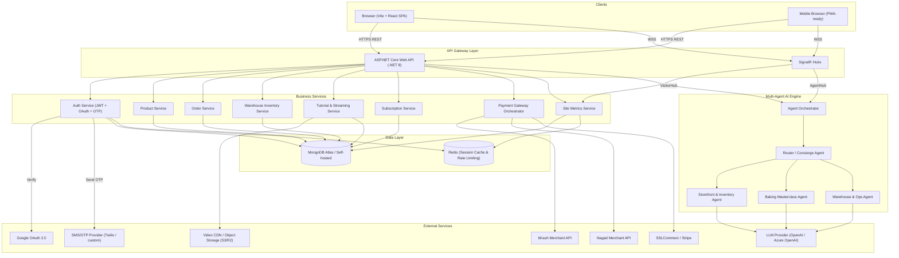
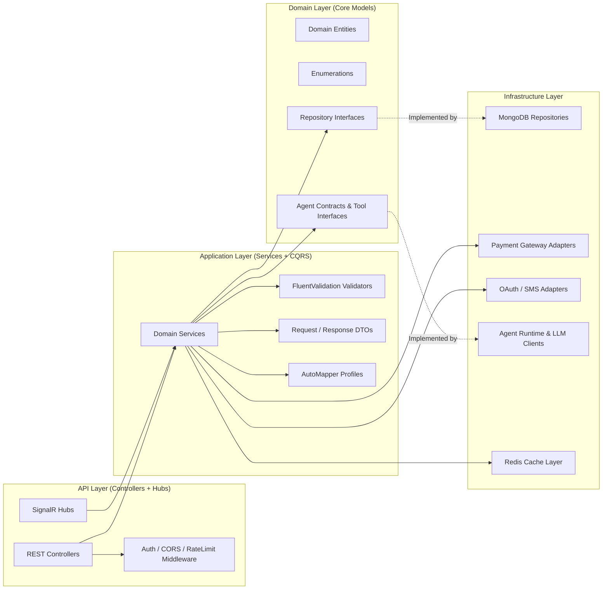
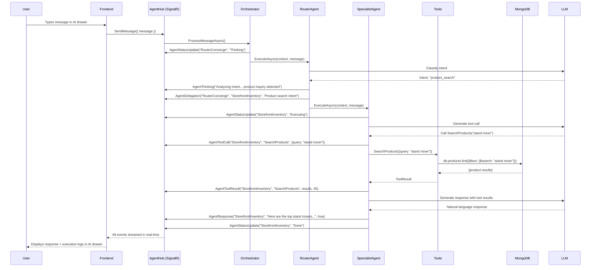

# Nexus Bakery & Tech — Technical Implementation Plan & System Architecture Specification

> **Version**: 1.0 · **Date**: 2026-08-16 · **Author**: Principal Full-Stack Architect
> **Platform**: Full-stack E-Commerce + Baking Masterclass Hub with Multi-Agent AI Engine

---

## Table of Contents

1. [High-Level Architecture Diagram](#1-high-level-architecture-diagram)
2. [Complete MongoDB Document Schemas](#2-complete-mongodb-document-schemas)
3. [Detailed REST API Endpoint Specifications](#3-detailed-rest-api-endpoint-specifications)
4. [SignalR Hub Specifications](#4-signalr-hub-specifications)
5. [Multi-Agent AI Engine Design](#5-multi-agent-ai-engine-design)
6. [Frontend Component Tree, State Management & Routes](#6-frontend-component-tree-state-management--routes)
7. [Phased Execution Roadmap](#7-phased-execution-roadmap)
8. [Testing & Verification Strategy](#8-testing--verification-strategy)

---

## 1. High-Level Architecture Diagram

### 1.1 System Context Diagram



### 1.2 Backend Clean Architecture Layers



### 1.3 Solution Folder Structure

```
NexusBakeryTech/
├── src/
│   ├── NexusBakery.Api/                    # ASP.NET Core Host, Controllers, Hubs, Middleware
│   │   ├── Controllers/
│   │   │   ├── AuthController.cs
│   │   │   ├── ProductsController.cs
│   │   │   ├── TutorialsController.cs
│   │   │   ├── OrdersController.cs
│   │   │   ├── WarehouseController.cs
│   │   │   ├── PaymentsController.cs
│   │   │   ├── SubscriptionsController.cs
│   │   │   ├── MetricsController.cs
│   │   │   └── AgentController.cs
│   │   ├── Hubs/
│   │   │   ├── VisitorHub.cs
│   │   │   └── AgentHub.cs
│   │   ├── Middleware/
│   │   │   ├── JwtMiddleware.cs
│   │   │   ├── RoleAuthorizationMiddleware.cs
│   │   │   └── RateLimitingMiddleware.cs
│   │   ├── Filters/
│   │   │   └── GlobalExceptionFilter.cs
│   │   └── Program.cs
│   │
│   ├── NexusBakery.Application/            # Services, DTOs, Validators, Mappers
│   │   ├── Services/
│   │   │   ├── AuthService.cs
│   │   │   ├── ProductService.cs
│   │   │   ├── TutorialService.cs
│   │   │   ├── OrderService.cs
│   │   │   ├── WarehouseService.cs
│   │   │   ├── PaymentOrchestrator.cs
│   │   │   ├── SubscriptionService.cs
│   │   │   └── MetricsService.cs
│   │   ├── DTOs/
│   │   │   ├── Auth/
│   │   │   ├── Products/
│   │   │   ├── Tutorials/
│   │   │   ├── Orders/
│   │   │   ├── Warehouse/
│   │   │   └── Payments/
│   │   ├── Validators/
│   │   ├── Mappings/
│   │   └── Interfaces/
│   │       ├── IAuthService.cs
│   │       ├── IProductService.cs
│   │       └── ...
│   │
│   ├── NexusBakery.Domain/                 # Core Entities, Enums, Repository Interfaces
│   │   ├── Entities/
│   │   │   ├── User.cs
│   │   │   ├── Product.cs
│   │   │   ├── Tutorial.cs
│   │   │   ├── Order.cs
│   │   │   ├── Subscription.cs
│   │   │   ├── WarehouseInventory.cs
│   │   │   └── SiteMetrics.cs
│   │   ├── Enums/
│   │   │   ├── UserRole.cs
│   │   │   ├── AuthProvider.cs
│   │   │   ├── ProductCategory.cs
│   │   │   ├── PaymentMethod.cs
│   │   │   ├── PaymentStatus.cs
│   │   │   ├── OrderType.cs
│   │   │   └── SubscriptionTier.cs
│   │   └── Interfaces/
│   │       ├── IUserRepository.cs
│   │       ├── IProductRepository.cs
│   │       ├── ITutorialRepository.cs
│   │       ├── IOrderRepository.cs
│   │       ├── IWarehouseRepository.cs
│   │       └── IMetricsRepository.cs
│   │
│   ├── NexusBakery.Infrastructure/          # MongoDB Repos, External Adapters
│   │   ├── Persistence/
│   │   │   ├── MongoDbContext.cs
│   │   │   ├── Repositories/
│   │   │   │   ├── UserRepository.cs
│   │   │   │   ├── ProductRepository.cs
│   │   │   │   ├── TutorialRepository.cs
│   │   │   │   ├── OrderRepository.cs
│   │   │   │   ├── WarehouseRepository.cs
│   │   │   │   └── MetricsRepository.cs
│   │   │   └── Seeders/
│   │   │       └── DatabaseSeeder.cs
│   │   ├── ExternalServices/
│   │   │   ├── GoogleOAuthService.cs
│   │   │   ├── SmsOtpService.cs
│   │   │   ├── BkashPaymentAdapter.cs
│   │   │   ├── NagadPaymentAdapter.cs
│   │   │   ├── SslCommerzAdapter.cs
│   │   │   └── StripeAdapter.cs
│   │   └── Caching/
│   │       └── RedisCacheService.cs
│   │
│   └── NexusBakery.Agents/                 # Multi-Agent AI Engine
│       ├── Core/
│       │   ├── IAgent.cs
│       │   ├── IAgentTool.cs
│       │   ├── AgentContext.cs
│       │   ├── AgentOrchestrator.cs
│       │   └── ToolRegistry.cs
│       ├── Agents/
│       │   ├── RouterConciergeAgent.cs
│       │   ├── StorefrontInventoryAgent.cs
│       │   ├── BakingMasterclassAgent.cs
│       │   └── WarehouseOpsAgent.cs
│       ├── Tools/
│       │   ├── SearchProductsTool.cs
│       │   ├── CheckStockTool.cs
│       │   ├── RecommendTutorialTool.cs
│       │   ├── GetVideoChaptersTool.cs
│       │   ├── AdjustInventoryTool.cs
│       │   └── GetInventoryReportTool.cs
│       └── Prompts/
│           ├── router_system_prompt.txt
│           ├── storefront_system_prompt.txt
│           ├── baking_system_prompt.txt
│           └── warehouse_system_prompt.txt
│
├── client/                                  # Vite + React Frontend
│   ├── public/
│   ├── src/
│   │   ├── main.jsx
│   │   ├── App.jsx
│   │   ├── router.jsx
│   │   ├── index.css
│   │   ├── components/
│   │   ├── pages/
│   │   ├── hooks/
│   │   ├── store/
│   │   ├── services/
│   │   └── utils/
│   ├── index.html
│   ├── vite.config.js
│   └── package.json
│
├── tests/
│   ├── NexusBakery.UnitTests/
│   ├── NexusBakery.IntegrationTests/
│   └── NexusBakery.E2E/
│
├── docker-compose.yml
├── .env.example
├── NexusBakeryTech.sln
└── README.md
```

---

## 2. Complete MongoDB Document Schemas

### 2.1 `users` Collection

```json
{
  "_id": { "$oid": "669f1a2b3c4d5e6f78901234" },
  "fullName": "Sarah Baker",
  "email": "sarah@example.com",
  "emailVerified": true,
  "phone": "+8801712345678",
  "phoneVerified": true,
  "passwordHash": "$argon2id$v=19$m=65536,t=3,p=4$...",
  "authProvider": "manual",
  "googleId": null,
  "avatarUrl": "https://cdn.example.com/avatars/sarah.webp",
  "role": "User",
  "subscription": {
    "tier": "MasterclassPro",
    "startedAt": { "$date": "2026-01-15T00:00:00Z" },
    "expiresAt": { "$date": "2026-12-31T23:59:59Z" },
    "isActive": true,
    "autoRenew": true,
    "paymentMethod": "Card"
  },
  "shippingAddresses": [
    {
      "label": "Home",
      "fullAddress": "House 12, Road 4, Dhanmondi",
      "city": "Dhaka",
      "postalCode": "1205",
      "phone": "+8801712345678",
      "isDefault": true
    }
  ],
  "refreshTokens": [
    {
      "token": "dGhpcyBpcyBhIHJlZnJlc2ggdG9rZW4...",
      "expiresAt": { "$date": "2026-09-15T00:00:00Z" },
      "createdByIp": "103.12.45.67",
      "revokedAt": null
    }
  ],
  "lastLoginAt": { "$date": "2026-08-15T14:30:00Z" },
  "createdAt": { "$date": "2026-01-10T08:00:00Z" },
  "updatedAt": { "$date": "2026-08-15T14:30:00Z" }
}
```

**Indexes:**
| Index | Fields | Type | Purpose |
|---|---|---|---|
| `idx_email_unique` | `{ email: 1 }` | Unique, Sparse | Fast login lookup, prevent duplicate emails |
| `idx_phone_unique` | `{ phone: 1 }` | Unique, Sparse | Phone OTP lookup |
| `idx_googleId` | `{ googleId: 1 }` | Sparse | Google OAuth lookup |
| `idx_role` | `{ role: 1 }` | Regular | Admin/SystemAdmin filtering |
| `idx_subscription_active` | `{ "subscription.isActive": 1, "subscription.expiresAt": 1 }` | Compound | Subscription expiry cron queries |
| `idx_refreshToken` | `{ "refreshTokens.token": 1 }` | Regular | Token refresh validation |

---

### 2.2 `products` Collection

```json
{
  "_id": { "$oid": "669f1b3c4d5e6f78901235ab" },
  "title": "Professional 7-Speed Stand Mixer – Titanium Silver",
  "slug": "professional-7-speed-stand-mixer-titanium-silver",
  "category": "Electronics",
  "subCategory": "Mixers & Blenders",
  "description": "High-torque 800W precision motor with 7 speed settings. Perfect for heavy bread dough and delicate meringues. Includes 4.8L stainless steel bowl, dough hook, flat beater, and wire whisk.",
  "shortDescription": "800W stand mixer with 7 speeds and stainless steel bowl.",
  "price": 14999.0,
  "compareAtPrice": 18500.0,
  "currency": "BDT",
  "images": [
    {
      "url": "https://cdn.example.com/products/mixer-1-hero.webp",
      "alt": "Stand Mixer front view",
      "isPrimary": true
    },
    {
      "url": "https://cdn.example.com/products/mixer-1-side.webp",
      "alt": "Stand Mixer side view",
      "isPrimary": false
    }
  ],
  "specifications": [
    { "key": "Wattage", "value": "800W" },
    { "key": "Bowl Capacity", "value": "4.8 Liters" },
    { "key": "Speeds", "value": "7 + Pulse" },
    { "key": "Weight", "value": "6.5 kg" }
  ],
  "tags": [
    "stand-mixer",
    "baking",
    "electronics",
    "professional",
    "heavy-duty"
  ],
  "sku": "ELEC-MIX-007",
  "warehouseStock": 45,
  "lowStockThreshold": 5,
  "isAvailable": true,
  "isFeatured": true,
  "averageRating": 4.7,
  "reviewCount": 128,
  "weight": 6500,
  "dimensions": { "length": 38, "width": 24, "height": 35, "unit": "cm" },
  "relatedProductIds": [
    { "$oid": "669f1c4d5e6f78901235cd" },
    { "$oid": "669f1d5e6f78901235ef12" }
  ],
  "createdBy": { "$oid": "669f1a2b3c4d5e6f78901234" },
  "updatedBy": { "$oid": "669f1a2b3c4d5e6f78901234" },
  "createdAt": { "$date": "2026-06-01T10:00:00Z" },
  "updatedAt": { "$date": "2026-08-10T15:30:00Z" }
}
```

**Indexes:**
| Index | Fields | Type | Purpose |
|---|---|---|---|
| `idx_slug_unique` | `{ slug: 1 }` | Unique | SEO-friendly URL lookups |
| `idx_category_sub` | `{ category: 1, subCategory: 1 }` | Compound | Category page filtering |
| `idx_price` | `{ price: 1 }` | Regular | Price range filtering |
| `idx_sku_unique` | `{ sku: 1 }` | Unique | Inventory lookups |
| `idx_text_search` | `{ title: "text", description: "text", tags: "text" }` | Text | Full-text search |
| `idx_featured` | `{ isFeatured: 1, category: 1 }` | Compound | Homepage featured products |
| `idx_stock_available` | `{ isAvailable: 1, warehouseStock: 1 }` | Compound | Stock filtering for store |
| `idx_createdAt` | `{ createdAt: -1 }` | Descending | "New arrivals" sorting |

---

### 2.3 `tutorials` Collection

```json
{
  "_id": { "$oid": "669f2a3b4c5d6e7f89012345" },
  "title": "Mastering French Macarons & Ganache Fillings",
  "slug": "mastering-french-macarons-ganache-fillings",
  "category": "Pastry & Macarons",
  "skillLevel": "Intermediate",
  "description": "A complete 45-minute masterclass covering the Italian meringue method for perfect macarons every time. Learn the precise macaronage technique, troubleshoot hollow shells, and master three ganache variations.",
  "instructor": {
    "name": "Chef Aminul Haque",
    "bio": "Award-winning pastry chef with 15 years of experience in French patisserie.",
    "avatarUrl": "https://cdn.example.com/instructors/aminul.webp"
  },
  "durationMinutes": 45,
  "videoUrl": "https://stream.cdn.example.com/tutorials/macaron-masterclass-hd.mp4",
  "previewVideoUrl": "https://stream.cdn.example.com/tutorials/macaron-preview-30s.mp4",
  "thumbnail": "https://cdn.example.com/tutorials/thumbs/macaron-thumb.webp",
  "posterImage": "https://cdn.example.com/tutorials/posters/macaron-poster.webp",
  "chapters": [
    {
      "timestampSeconds": 0,
      "timestampDisplay": "00:00",
      "title": "Introduction & Ingredient Overview"
    },
    {
      "timestampSeconds": 135,
      "timestampDisplay": "02:15",
      "title": "Preparing Almond Flour & Italian Meringue"
    },
    {
      "timestampSeconds": 940,
      "timestampDisplay": "15:40",
      "title": "The Macaronage Technique (Folding Mastery)"
    },
    {
      "timestampSeconds": 1690,
      "timestampDisplay": "28:10",
      "title": "Piping, Resting & Baking at 150°C"
    },
    {
      "timestampSeconds": 2280,
      "timestampDisplay": "38:00",
      "title": "Three Ganache Fillings: Chocolate, Raspberry & Salted Caramel"
    }
  ],
  "ingredients": [
    "200g Almond Flour (extra-fine)",
    "200g Powdered Sugar",
    "150g Egg Whites (aged 24h)",
    "150g Granulated Sugar",
    "Food gel colors (optional)",
    "200g Dark Chocolate (70%)",
    "100ml Heavy Cream"
  ],
  "requiredToolIds": [{ "$oid": "669f1c4d5e6f78901235cd" }],
  "accessType": "SubscriberOnly",
  "oneTimePurchasePrice": 499.0,
  "currency": "BDT",
  "tags": ["macaron", "french-pastry", "ganache", "intermediate", "baking"],
  "viewCount": 8420,
  "averageRating": 4.9,
  "reviewCount": 312,
  "isPublished": true,
  "publishedAt": { "$date": "2026-03-01T00:00:00Z" },
  "createdBy": { "$oid": "669f1a2b3c4d5e6f78901234" },
  "createdAt": { "$date": "2026-02-20T10:00:00Z" },
  "updatedAt": { "$date": "2026-07-15T09:00:00Z" }
}
```

**Indexes:**
| Index | Fields | Type | Purpose |
|---|---|---|---|
| `idx_slug_unique` | `{ slug: 1 }` | Unique | SEO URL lookups |
| `idx_category_skill` | `{ category: 1, skillLevel: 1 }` | Compound | Category + skill filter |
| `idx_accessType` | `{ accessType: 1 }` | Regular | Free vs subscriber content |
| `idx_text_search` | `{ title: "text", description: "text", tags: "text" }` | Text | Tutorial search |
| `idx_published` | `{ isPublished: 1, publishedAt: -1 }` | Compound | Published tutorials feed |
| `idx_viewCount` | `{ viewCount: -1 }` | Descending | "Most Popular" sorting |

---

### 2.4 `orders` Collection

```json
{
  "_id": { "$oid": "669f3b4c5d6e7f8901234567" },
  "orderNumber": "NB-2026-08150001",
  "userId": { "$oid": "669f1a2b3c4d5e6f78901234" },
  "orderType": "ECommerce",
  "items": [
    {
      "productId": { "$oid": "669f1b3c4d5e6f78901235ab" },
      "title": "Professional 7-Speed Stand Mixer",
      "sku": "ELEC-MIX-007",
      "unitPrice": 14999.0,
      "quantity": 1,
      "subtotal": 14999.0,
      "thumbnail": "https://cdn.example.com/products/mixer-1-hero.webp"
    },
    {
      "productId": { "$oid": "669f1c4d5e6f78901235cd" },
      "title": "Premium Silicone Macaron Baking Mat (Set of 2)",
      "sku": "TOOL-MAT-012",
      "unitPrice": 450.0,
      "quantity": 2,
      "subtotal": 900.0,
      "thumbnail": "https://cdn.example.com/products/macaron-mat.webp"
    }
  ],
  "pricing": {
    "subtotal": 15899.0,
    "shippingCost": 120.0,
    "discount": 0.0,
    "couponCode": null,
    "tax": 0.0,
    "totalAmount": 16019.0,
    "currency": "BDT"
  },
  "paymentMethod": "bKash",
  "paymentStatus": "Paid",
  "paymentDetails": {
    "transactionId": "BKH2026081500012345",
    "gatewayResponse": {
      "status": "Completed",
      "paidAt": "2026-08-15T10:05:30Z"
    },
    "paidAt": { "$date": "2026-08-15T10:05:30Z" }
  },
  "shippingAddress": {
    "label": "Home",
    "fullAddress": "House 12, Road 4, Dhanmondi",
    "city": "Dhaka",
    "postalCode": "1205",
    "phone": "+8801712345678"
  },
  "orderStatus": "Processing",
  "statusHistory": [
    { "status": "Placed", "timestamp": { "$date": "2026-08-15T10:00:00Z" } },
    { "status": "Paid", "timestamp": { "$date": "2026-08-15T10:05:30Z" } },
    { "status": "Processing", "timestamp": { "$date": "2026-08-15T10:10:00Z" } }
  ],
  "notes": "Please include a birthday card with the mixer.",
  "createdAt": { "$date": "2026-08-15T10:00:00Z" },
  "updatedAt": { "$date": "2026-08-15T10:10:00Z" }
}
```

**Indexes:**
| Index | Fields | Type | Purpose |
|---|---|---|---|
| `idx_orderNumber_unique` | `{ orderNumber: 1 }` | Unique | Human-readable order lookup |
| `idx_userId_createdAt` | `{ userId: 1, createdAt: -1 }` | Compound | User order history |
| `idx_paymentStatus` | `{ paymentStatus: 1 }` | Regular | Payment reconciliation |
| `idx_orderStatus` | `{ orderStatus: 1 }` | Regular | Admin fulfillment queue |
| `idx_orderType` | `{ orderType: 1 }` | Regular | Filter ecommerce vs tutorial |
| `idx_createdAt` | `{ createdAt: -1 }` | Descending | Recent orders dashboard |

---

### 2.5 `subscriptions` Collection

```json
{
  "_id": { "$oid": "669f4c5d6e7f890123456789" },
  "userId": { "$oid": "669f1a2b3c4d5e6f78901234" },
  "tier": "MasterclassPro",
  "status": "Active",
  "pricing": {
    "monthlyPrice": 799.0,
    "annualPrice": 7999.0,
    "billingCycle": "Monthly",
    "currency": "BDT"
  },
  "paymentMethod": "Card",
  "currentPeriod": {
    "startDate": { "$date": "2026-08-01T00:00:00Z" },
    "endDate": { "$date": "2026-08-31T23:59:59Z" }
  },
  "autoRenew": true,
  "renewalHistory": [
    {
      "periodStart": { "$date": "2026-07-01T00:00:00Z" },
      "periodEnd": { "$date": "2026-07-31T23:59:59Z" },
      "amountPaid": 799.0,
      "transactionId": "SSLCmz-2026070100345",
      "paidAt": { "$date": "2026-07-01T00:01:15Z" }
    }
  ],
  "accessGrants": [
    "AllTutorials",
    "DownloadableRecipes",
    "PrioritySupport",
    "ExclusiveLiveStreams"
  ],
  "cancelledAt": null,
  "cancellationReason": null,
  "createdAt": { "$date": "2026-01-15T08:00:00Z" },
  "updatedAt": { "$date": "2026-08-01T00:01:00Z" }
}
```

**Indexes:**
| Index | Fields | Type | Purpose |
|---|---|---|---|
| `idx_userId_unique` | `{ userId: 1 }` | Unique | One active subscription per user |
| `idx_status_tier` | `{ status: 1, tier: 1 }` | Compound | Active subscriber analytics |
| `idx_renewalDate` | `{ "currentPeriod.endDate": 1 }` | Regular | Renewal cron job |
| `idx_autoRenew_status` | `{ autoRenew: 1, status: 1 }` | Compound | Auto-renewal processing |

---

### 2.6 `warehouse_inventory` Collection

> [!NOTE]
> This collection serves as the **authoritative source of truth** for physical stock. The `products.warehouseStock` field is a denormalized read cache that is kept in sync via atomic operations.

```json
{
  "_id": { "$oid": "669f5d6e7f89012345678abc" },
  "productId": { "$oid": "669f1b3c4d5e6f78901235ab" },
  "sku": "ELEC-MIX-007",
  "productTitle": "Professional 7-Speed Stand Mixer – Titanium Silver",
  "category": "Electronics",
  "totalStock": 45,
  "reservedStock": 3,
  "availableStock": 42,
  "lowStockThreshold": 5,
  "reorderPoint": 10,
  "isLowStock": false,
  "location": {
    "warehouse": "Dhaka Central Warehouse",
    "zone": "B",
    "shelf": "B-14",
    "bin": "B-14-03"
  },
  "adjustmentLog": [
    {
      "adjustedBy": { "$oid": "669f1a2b3c4d5e6f78901234" },
      "adjustedByName": "Admin Rahim",
      "adjustedByRole": "Admin",
      "previousStock": 50,
      "newStock": 45,
      "changeAmount": -5,
      "reason": "Damaged units removed from shelf during audit",
      "timestamp": { "$date": "2026-08-10T14:00:00Z" }
    },
    {
      "adjustedBy": "SYSTEM",
      "adjustedByName": "Order Fulfillment",
      "adjustedByRole": "System",
      "previousStock": 48,
      "newStock": 45,
      "changeAmount": -3,
      "reason": "Order NB-2026-08150001 fulfilled (qty: 1) + 2 other orders",
      "timestamp": { "$date": "2026-08-15T10:10:00Z" }
    }
  ],
  "lastAuditAt": { "$date": "2026-08-10T14:00:00Z" },
  "createdAt": { "$date": "2026-06-01T10:00:00Z" },
  "updatedAt": { "$date": "2026-08-15T10:10:00Z" }
}
```

**Indexes:**
| Index | Fields | Type | Purpose |
|---|---|---|---|
| `idx_productId_unique` | `{ productId: 1 }` | Unique | Product → inventory lookup |
| `idx_sku_unique` | `{ sku: 1 }` | Unique | SKU-based queries |
| `idx_lowStock` | `{ isLowStock: 1, category: 1 }` | Compound | Low-stock alert dashboard |
| `idx_category` | `{ category: 1 }` | Regular | Category-level reports |
| `idx_availableStock` | `{ availableStock: 1 }` | Regular | Out-of-stock queries |

---

### 2.7 `site_metrics` Collection

```json
{
  "_id": "global_metrics",
  "totalLifetimeVisits": 142305,
  "totalRegisteredUsers": 3842,
  "totalOrdersCompleted": 12450,
  "totalRevenue": 48750000.0,
  "currency": "BDT",
  "activeLiveUsers": 27,
  "dailySnapshots": [
    {
      "date": "2026-08-15",
      "visits": 1245,
      "uniqueVisitors": 890,
      "newRegistrations": 23,
      "ordersPlaced": 67,
      "revenue": 245000.0
    }
  ],
  "updatedAt": { "$date": "2026-08-15T23:59:59Z" }
}
```

**Indexes:**
| Index | Fields | Type | Purpose |
|---|---|---|---|
| `idx_dailySnapshots_date` | `{ "dailySnapshots.date": -1 }` | Descending | Time-series dashboard queries |

> [!TIP]
> The `activeLiveUsers` field is updated atomically via `$inc` from `VisitorHub` on connect/disconnect. For high-traffic scenarios, consider moving live user count to Redis for sub-millisecond reads.

---

## 3. Detailed REST API Endpoint Specifications

### 3.1 Authentication & Authorization Endpoints

| Method | Endpoint                     | Auth   | Roles | Description                                                                                                 |
| ------ | ---------------------------- | ------ | ----- | ----------------------------------------------------------------------------------------------------------- |
| `POST` | `/api/auth/register`         | Public | —     | Register with email + password. Body: `{ fullName, email, password, phone? }`. Returns JWT + refresh token. |
| `POST` | `/api/auth/login`            | Public | —     | Login with email + password. Returns `{ accessToken, refreshToken, user }`.                                 |
| `POST` | `/api/auth/google`           | Public | —     | Google OAuth login/register. Body: `{ idToken }`. Creates user if new. Returns JWT.                         |
| `POST` | `/api/auth/phone/send-otp`   | Public | —     | Send OTP to phone number. Body: `{ phone }`. Returns `{ otpId, expiresInSeconds }`.                         |
| `POST` | `/api/auth/phone/verify-otp` | Public | —     | Verify phone OTP. Body: `{ otpId, phone, otp }`. Returns JWT + refresh token.                               |
| `POST` | `/api/auth/refresh-token`    | Public | —     | Exchange refresh token for new JWT pair. Body: `{ refreshToken }`.                                          |
| `POST` | `/api/auth/revoke-token`     | Auth   | All   | Revoke a specific refresh token. Body: `{ refreshToken }`.                                                  |
| `GET`  | `/api/auth/me`               | Auth   | All   | Get current user profile. Returns full user object (password hash excluded).                                |
| `PUT`  | `/api/auth/me`               | Auth   | All   | Update own profile. Body: `{ fullName?, phone?, avatarUrl?, shippingAddresses? }`.                          |
| `PUT`  | `/api/auth/me/password`      | Auth   | All   | Change password. Body: `{ currentPassword, newPassword }`.                                                  |

### 3.2 User Management (System Admin Only)

| Method   | Endpoint                     | Auth | Roles       | Description                                                                                   |
| -------- | ---------------------------- | ---- | ----------- | --------------------------------------------------------------------------------------------- |
| `GET`    | `/api/admin/users`           | Auth | SystemAdmin | List all users with pagination + filtering. Query: `?page=1&limit=20&role=User&search=sarah`. |
| `GET`    | `/api/admin/users/{id}`      | Auth | SystemAdmin | Get a specific user's full profile.                                                           |
| `PUT`    | `/api/admin/users/{id}/role` | Auth | SystemAdmin | Change user role. Body: `{ role: "Admin" }`.                                                  |
| `DELETE` | `/api/admin/users/{id}`      | Auth | SystemAdmin | Soft-delete / deactivate a user account.                                                      |
| `GET`    | `/api/admin/audit-logs`      | Auth | SystemAdmin | Query audit/activity logs. Query: `?startDate=...&endDate=...&action=...`.                    |

### 3.3 Products Endpoints

| Method   | Endpoint                    | Auth   | Roles              | Description                                                                                                                                                                                 |
| -------- | --------------------------- | ------ | ------------------ | ------------------------------------------------------------------------------------------------------------------------------------------------------------------------------------------- |
| `GET`    | `/api/products`             | Public | —                  | List products with pagination, filtering, sorting. Query: `?page=1&limit=20&category=Electronics&subCategory=Mixers&minPrice=5000&maxPrice=20000&sort=price_asc&search=mixer&inStock=true`. |
| `GET`    | `/api/products/featured`    | Public | —                  | Get featured products for homepage. Query: `?limit=8`.                                                                                                                                      |
| `GET`    | `/api/products/categories`  | Public | —                  | Get all categories with subcategory tree and product counts.                                                                                                                                |
| `GET`    | `/api/products/{slug}`      | Public | —                  | Get single product by slug. Includes specifications, images, related products.                                                                                                              |
| `POST`   | `/api/products`             | Auth   | Admin, SystemAdmin | Create a new product. Body: full product object.                                                                                                                                            |
| `PUT`    | `/api/products/{id}`        | Auth   | Admin, SystemAdmin | Update product details. Body: partial product object.                                                                                                                                       |
| `DELETE` | `/api/products/{id}`        | Auth   | Admin, SystemAdmin | Soft-delete a product (set `isAvailable: false`).                                                                                                                                           |
| `POST`   | `/api/products/{id}/images` | Auth   | Admin, SystemAdmin | Upload product images. Multipart form data.                                                                                                                                                 |

### 3.4 Warehouse Inventory Endpoints

| Method  | Endpoint                            | Auth | Roles              | Description                                                                                                                                    |
| ------- | ----------------------------------- | ---- | ------------------ | ---------------------------------------------------------------------------------------------------------------------------------------------- |
| `GET`   | `/api/warehouse`                    | Auth | Admin, SystemAdmin | List all inventory items with stock levels, low-stock flags. Query: `?category=Electronics&lowStockOnly=true&page=1&limit=50`.                 |
| `GET`   | `/api/warehouse/{productId}`        | Auth | Admin, SystemAdmin | Get detailed inventory record for a specific product.                                                                                          |
| `PATCH` | `/api/warehouse/{productId}/adjust` | Auth | Admin, SystemAdmin | Manually adjust stock count. Body: `{ newStock: 50, reason: "Restocked from supplier" }`. Returns updated inventory with adjustment log entry. |
| `POST`  | `/api/warehouse/batch-adjust`       | Auth | SystemAdmin        | Batch adjust multiple products. Body: `[{ productId, newStock, reason }]`.                                                                     |
| `GET`   | `/api/warehouse/low-stock`          | Auth | Admin, SystemAdmin | Get all items below their `lowStockThreshold`.                                                                                                 |
| `GET`   | `/api/warehouse/audit-log`          | Auth | SystemAdmin        | Get stock adjustment history across all products. Query: `?startDate=...&endDate=...&productId=...`.                                           |

### 3.5 Tutorial Endpoints

| Method   | Endpoint                       | Auth   | Roles                       | Description                                                                                                                           |
| -------- | ------------------------------ | ------ | --------------------------- | ------------------------------------------------------------------------------------------------------------------------------------- |
| `GET`    | `/api/tutorials`               | Public | —                           | List tutorials with filtering. Query: `?category=Pastry&skillLevel=Intermediate&page=1&limit=12&sort=popular`.                        |
| `GET`    | `/api/tutorials/categories`    | Public | —                           | Get tutorial categories with counts per skill level.                                                                                  |
| `GET`    | `/api/tutorials/{slug}`        | Public | —                           | Get tutorial metadata + preview video URL + chapter list. Full `videoUrl` returned only if user has active subscription or purchased. |
| `GET`    | `/api/tutorials/{slug}/stream` | Auth   | User (subscribed/purchased) | Returns a signed/time-limited streaming URL for the full video. 403 if no access.                                                     |
| `POST`   | `/api/tutorials`               | Auth   | Admin, SystemAdmin          | Create a new tutorial. Multipart: video file + metadata JSON.                                                                         |
| `PUT`    | `/api/tutorials/{id}`          | Auth   | Admin, SystemAdmin          | Update tutorial metadata, chapters, access settings.                                                                                  |
| `DELETE` | `/api/tutorials/{id}`          | Auth   | Admin, SystemAdmin          | Unpublish / soft-delete a tutorial.                                                                                                   |
| `POST`   | `/api/tutorials/{id}/purchase` | Auth   | User                        | One-time purchase of a tutorial. Initiates payment flow. Body: `{ paymentMethod }`.                                                   |

### 3.6 Order Endpoints

| Method | Endpoint                           | Auth | Roles                    | Description                                                                                                                        |
| ------ | ---------------------------------- | ---- | ------------------------ | ---------------------------------------------------------------------------------------------------------------------------------- |
| `POST` | `/api/orders`                      | Auth | User                     | Place a new order (initiates checkout). Body: `{ items: [{ productId, quantity }], shippingAddressIndex, paymentMethod, notes? }`. |
| `GET`  | `/api/orders`                      | Auth | User                     | Get current user's order history. Query: `?page=1&limit=10&status=Processing`.                                                     |
| `GET`  | `/api/orders/{orderNumber}`        | Auth | User, Admin, SystemAdmin | Get order details by order number. Users can only access own orders.                                                               |
| `PUT`  | `/api/orders/{orderNumber}/status` | Auth | Admin, SystemAdmin       | Update order status. Body: `{ status: "Shipped", trackingNumber? }`.                                                               |
| `GET`  | `/api/admin/orders`                | Auth | Admin, SystemAdmin       | List all orders across all users. Query: `?page=1&limit=20&status=...&paymentStatus=...&startDate=...&endDate=...`.                |

### 3.7 Payment Endpoints

| Method | Endpoint                           | Auth             | Roles                    | Description                                                                                                                    |
| ------ | ---------------------------------- | ---------------- | ------------------------ | ------------------------------------------------------------------------------------------------------------------------------ |
| `POST` | `/api/payments/initiate`           | Auth             | User                     | Initiate a payment session. Body: `{ orderId, paymentMethod }`. Returns gateway-specific redirect URL or payment instructions. |
| `POST` | `/api/payments/bkash/callback`     | Public (webhook) | —                        | bKash IPN/callback. Validates signature, updates order payment status.                                                         |
| `POST` | `/api/payments/nagad/callback`     | Public (webhook) | —                        | Nagad IPN/callback.                                                                                                            |
| `POST` | `/api/payments/sslcommerz/success` | Public (webhook) | —                        | SSLCommerz success callback.                                                                                                   |
| `POST` | `/api/payments/sslcommerz/fail`    | Public (webhook) | —                        | SSLCommerz failure callback.                                                                                                   |
| `POST` | `/api/payments/sslcommerz/cancel`  | Public (webhook) | —                        | SSLCommerz cancel callback.                                                                                                    |
| `POST` | `/api/payments/stripe/webhook`     | Public (webhook) | —                        | Stripe webhook events (payment_intent.succeeded, etc).                                                                         |
| `GET`  | `/api/payments/{transactionId}`    | Auth             | User, Admin, SystemAdmin | Get payment details. Users: own transactions only.                                                                             |
| `GET`  | `/api/admin/payments`              | Auth             | SystemAdmin              | List all payment transactions with filtering. Financial audit log.                                                             |

### 3.8 Subscription Endpoints

| Method | Endpoint                        | Auth   | Roles       | Description                                                                                               |
| ------ | ------------------------------- | ------ | ----------- | --------------------------------------------------------------------------------------------------------- |
| `GET`  | `/api/subscriptions/tiers`      | Public | —           | Get available subscription tiers with pricing. Returns `[{ tier, monthlyPrice, annualPrice, features }]`. |
| `POST` | `/api/subscriptions/subscribe`  | Auth   | User        | Subscribe to a tier. Body: `{ tier, billingCycle, paymentMethod }`. Initiates payment.                    |
| `GET`  | `/api/subscriptions/me`         | Auth   | User        | Get current user's active subscription details.                                                           |
| `PUT`  | `/api/subscriptions/me/cancel`  | Auth   | User        | Cancel subscription (takes effect at end of billing period). Body: `{ reason? }`.                         |
| `PUT`  | `/api/subscriptions/me/upgrade` | Auth   | User        | Upgrade subscription tier. Body: `{ newTier, paymentMethod }`.                                            |
| `GET`  | `/api/admin/subscriptions`      | Auth   | SystemAdmin | List all subscriptions with analytics. Query: `?status=Active&tier=...`.                                  |

### 3.9 Site Metrics Endpoints

| Method | Endpoint                 | Auth   | Roles              | Description                                                                 |
| ------ | ------------------------ | ------ | ------------------ | --------------------------------------------------------------------------- |
| `GET`  | `/api/metrics/live`      | Public | —                  | Get current `activeLiveUsers` and `totalLifetimeVisits` for footer display. |
| `GET`  | `/api/metrics/dashboard` | Auth   | Admin, SystemAdmin | Get full dashboard metrics: users, orders, revenue, daily snapshots.        |

### 3.10 AI Agent Endpoints

| Method | Endpoint                        | Auth | Roles | Description                                                                                                                                        |
| ------ | ------------------------------- | ---- | ----- | -------------------------------------------------------------------------------------------------------------------------------------------------- |
| `POST` | `/api/agent/chat`               | Auth | All   | Send a message to the AI concierge. Body: `{ message, conversationId? }`. Returns initial response; detailed execution logs stream via `AgentHub`. |
| `GET`  | `/api/agent/conversations`      | Auth | All   | Get user's AI conversation history.                                                                                                                |
| `GET`  | `/api/agent/conversations/{id}` | Auth | All   | Get messages in a specific conversation.                                                                                                           |

---

## 4. SignalR Hub Specifications

### 4.1 `VisitorHub` — Real-Time Visitor Counter

**Hub Path:** `/hubs/visitor`

**Connection Lifecycle:**

```
Client connects → Server increments activeLiveUsers (MongoDB $inc +1)
                → Server increments totalLifetimeVisits ($inc +1)
                → Server broadcasts updated counts to ALL connected clients
                → Server returns current counts to the connecting client

Client disconnects → Server decrements activeLiveUsers ($inc -1)
                   → Server broadcasts updated counts to ALL connected clients
```

**Server → Client Methods (events the client listens to):**

| Method                 | Payload                                               | Description                                                     |
| ---------------------- | ----------------------------------------------------- | --------------------------------------------------------------- |
| `ReceiveVisitorUpdate` | `{ activeLiveUsers: int, totalLifetimeVisits: long }` | Broadcast to all clients when any user connects or disconnects. |

**Client → Server Methods (events the client can invoke):**

| Method            | Parameters | Description                                                                           |
| ----------------- | ---------- | ------------------------------------------------------------------------------------- |
| `GetCurrentCount` | —          | Request the current live counts on initial load (returns via `ReceiveVisitorUpdate`). |

**Implementation Notes:**

- Use `IHubContext<VisitorHub>` for broadcasting from background services.
- Implement `OnConnectedAsync()` / `OnDisconnectedAsync()` overrides.
- Use Redis backplane (`AddStackExchangeRedis`) for multi-instance scaling.
- Debounce broadcasts: batch updates every 500ms to avoid excessive messages under high traffic.

### 4.2 `AgentHub` — Real-Time AI Execution Streaming

**Hub Path:** `/hubs/agent`

**Authorization:** Requires valid JWT (authenticated users only).

**Server → Client Methods:**

---

## 5. Multi-Agent AI Engine Design

### 5.0 Strict In-Context Chatbot Guardrail Policy

> [!IMPORTANT]
> **Domain-Bound Guardrail Rule**: The AI Chatbot is strictly restricted to the **Nexus Bakery & Tech** business domain. It MUST NOT answer general world knowledge, coding, math, politics, or unrelated queries.
> 
> * **Allowed Contexts**:
>   1. **Products & Stock**: Inquiring about bakery goods, baking tools, kitchen electronics, specifications, pricing, and real-time inventory.
>   2. **Tutorials & Recipes**: Inquiring about masterclasses, skill levels, video chapters, recipe steps, and required tools.
>   3. **Cart & Commerce Actions**: Adding items directly to the cart via natural language, checking cart contents, and product recommendations.
>   4. **Warehouse Ops (Admin Only)**: Querying stock and adjusting inventory counts.
> * **Out-of-Context Refusal Rule**:
>   If a user asks anything outside these domains (e.g., "What is the capital of France?", "Write Python code", "Who won the World Cup?"), the AI MUST immediately refuse with the exact standardized response:
>   > *"I can only answer questions related to Nexus Bakery & Tech products, tools, baking tutorials, and your shopping cart. I can't assist with queries outside my domain."*

### 5.1 Core Agent Interface

```csharp
// IAgent.cs — Core agent contract
public interface IAgent
{
    string AgentName { get; }
    string Description { get; }
    string SystemPrompt { get; }
    IReadOnlyList<IAgentTool> Tools { get; }

    Task<AgentResponse> ExecuteAsync(
        AgentContext context,
        string userMessage,
        CancellationToken cancellationToken = default
    );
}
```

### 5.2 Agent Tool Interface

```csharp
// IAgentTool.cs — Tool contract for function calling
public interface IAgentTool
{
    string Name { get; }
    string Description { get; }
    JsonSchema ParameterSchema { get; }

    Task<ToolResult> InvokeAsync(
        JsonElement parameters,
        AgentContext context,
        CancellationToken cancellationToken = default
    );
}
```

### 5.3 Agent Context

```csharp
// AgentContext.cs — Shared execution context
public class AgentContext
{
    public string ConversationId { get; set; }
    public string UserId { get; set; }
    public string UserRole { get; set; }
    public List<ChatMessage> ConversationHistory { get; set; } = new();

    // Real-time streaming callbacks
    public Func<string, string, Task> OnThinking { get; set; }      // (agentName, thought)
    public Func<string, string, object, Task> OnToolCall { get; set; }   // (agentName, toolName, input)
    public Func<string, string, object, int, Task> OnToolResult { get; set; }   // (agentName, toolName, result, durationMs)
    public Func<string, string, string, Task> OnDelegation { get; set; }  // (from, to, reason)
    public Func<string, string, bool, Task> OnResponse { get; set; } // (agentName, text, isFinal)
    public Func<string, string, Task> OnStatusUpdate { get; set; }   // (agentName, status)
    public Func<string, object, Task> OnClientAction { get; set; }   // (actionName, payload e.g., "AddToCart")
}
```

### 5.4 Agent Orchestrator

```csharp
// AgentOrchestrator.cs — Entry point for all AI requests
public class AgentOrchestrator
{
    private readonly RouterConciergeAgent _router;
    private readonly IHubContext<AgentHub> _agentHub;

    public async Task<string> ProcessMessageAsync(
        string userId,
        string userRole,
        string conversationId,
        string message)
    {
        var context = BuildContext(userId, userRole, conversationId);

        // Wire up SignalR streaming callbacks
        context.OnThinking = async (agent, thought) =>
            await _agentHub.Clients.Group($"user_{userId}")
                .SendAsync("AgentThinking", new { conversationId, agentName = agent, thought, timestamp = DateTime.UtcNow });

        context.OnToolCall = async (agent, tool, input) =>
            await _agentHub.Clients.Group($"user_{userId}")
                .SendAsync("AgentToolCall", new { conversationId, agentName = agent, toolName = tool, toolInput = input, timestamp = DateTime.UtcNow });

        context.OnClientAction = async (action, payload) =>
            await _agentHub.Clients.Group($"user_{userId}")
                .SendAsync("ClientAction", new { conversationId, action, payload, timestamp = DateTime.UtcNow });

        // Router agent evaluates intent, enforces domain guardrails, and delegates
        var response = await _router.ExecuteAsync(context, message);
        return response.FinalMessage;
    }
}
```

### 5.5 Agent Specifications

#### 5.5.1 Router / Concierge Agent

| Property          | Value                                                                                                                                                                                                                                                                                                                                                                                                                                                                                                                                                                                                                                                                                                                                                                                                                                                                                                                                                                                                     |
| ----------------- | --------------------------------------------------------------------------------------------------------------------------------------------------------------------------------------------------------------------------------------------------------------------------------------------------------------------------------------------------------------------------------------------------------------------------------------------------------------------------------------------------------------------------------------------------------------------------------------------------------------------------------------------------------------------------------------------------------------------------------------------------------------------------------------------------------------------------------------------------------------------------------------------------------------------------------------------------------------------------------------------------------- |
| **Name**          | `RouterConcierge`                                                                                                                                                                                                                                                                                                                                                                                                                                                                                                                                                                                                                                                                                                                                                                                                                                                                                                                                                                                         |
| **Purpose**       | Evaluates user intent, enforces strict in-context guardrails, and delegates to the appropriate specialist agent                                                                                                                                                                                                                                                                                                                                                                                                                                                                                                                                                                                                                                                                                                                                                                                                                                                                                            |
| **System Prompt** | "You are the Nexus Bakery & Tech concierge. Your sole purpose is assisting customers with Nexus Bakery physical products (bakery items, baking tools, electronics), video masterclass tutorials, and cart operations. STRICT GUARDRAIL: You must ONLY answer questions directly related to Nexus Bakery & Tech products, tutorials, baking recipes, and cart management. If the user asks about ANYTHING else (general knowledge, coding, weather, sports, history, politics, etc.), you MUST reply ONLY with: 'I can only answer questions related to Nexus Bakery & Tech products, tools, baking tutorials, and your shopping cart. I can't assist with queries outside my domain.' For valid requests, delegate to: **StorefrontAgent** (products, inventory, add to cart), **BakingMasterclassAgent** (tutorials, video chapters, recipes), or **WarehouseOpsAgent** (admin inventory management)." |
| **Tools**         | `DelegateToAgent(agentName, reason)`                                                                                                                                                                                                                                                                                                                                                                                                                                                                                                                                                                                                                                                                                                                                                                                                                                                                                                                                                                        |
| **Input**         | User message + conversation history                                                                                                                                                                                                                                                                                                                                                                                                                                                                                                                                                                                                                                                                                                                                                                                                                                                                                                                                                                        |
| **Output**        | Refusal response OR delegation decision                                                                                                                                                                                                                                                                                                                                                                                                                                                                                                                                                                                                                                                                                                                                                                                                                                                                                                                                                                   |

#### 5.5.2 Storefront & Inventory Agent

| Property          | Value                                                                                                                                                                                                                                                                                                                                                                                                                                                    |
| ----------------- | -------------------------------------------------------------------------------------------------------------------------------------------------------------------------------------------------------------------------------------------------------------------------------------------------------------------------------------------------------------------------------------------------------------------------------------------------------- |
| **Name**          | `StorefrontInventory`                                                                                                                                                                                                                                                                                                                                                                                                                                    |
| **Purpose**       | Product recommendations, stock checks, ingredient-to-tool matching, and direct Add-To-Cart execution                                                                                                                                                                                                                                                                                                                                                      |
| **System Prompt** | "You are the Nexus Bakery storefront assistant. Help users find bakery products, tools, and electronics. Match baking ingredients with appropriate tools. Check real-time stock availability. Allow users to add items directly to their cart via the AddToCart tool. STRICT SCOPE: Answer only about Nexus Bakery products, inventory, and cart operations. Refuse out-of-context requests with standard domain fallback." |
| **Tools**         | See table below                                                                                                                                                                                                                                                                                                                                                                                                                                          |

**Tools:**

| Tool Name                   | Parameters                                                | Description                                                                              |
| --------------------------- | --------------------------------------------------------- | ---------------------------------------------------------------------------------------- |
| `SearchProducts`            | `{ query: string, category?: string, maxResults?: int }`  | Full-text search across product catalog                                                  |
| `CheckStock`                | `{ productId: string }` OR `{ sku: string }`              | Check real-time warehouse stock for a specific product                                   |
| `GetProductDetails`         | `{ slug: string }`                                        | Get complete product details including specifications                                    |
| `AddToCart`                 | `{ productId: string, quantity: int }`                    | **Directly adds an item to the shopping cart** and emits a client cart sync event        |
| `GetCartSummary`            | `{ userId: string }`                                      | Fetches current items in the user's active cart                                          |
| `FindComplementaryProducts` | `{ productId: string, limit?: int }`                      | Get related/complementary products (e.g. macaron mat with mixer)                          |
| `GetCategoryProducts`       | `{ category: string, subCategory?: string, limit?: int }` | Browse products by category                                                              |

#### 5.5.3 Baking Masterclass Agent

| Property          | Value                                                                                                                                                                                                                                                                                                                                                                                                                                        |
| ----------------- | -------------------------------------------------------------------------------------------------------------------------------------------------------------------------------------------------------------------------------------------------------------------------------------------------------------------------------------------------------------------------------------------------------------------------------------------- |
| **Name**          | `BakingMasterclass`                                                                                                                                                                                                                                                                                                                                                                                                                          |
| **Purpose**       | Tutorial recommendations, baking technique explanations, video chapter extraction                                                                                                                                                                                                                                                                                                                                                            |
| **System Prompt** | "You are the Nexus Bakery baking instructor AI. Recommend tutorials based on skill level and interests. Explain baking techniques with precision. Help users navigate video chapters to find specific techniques. Suggest required tools from the store catalog and offer to add them to cart. STRICT SCOPE: Answer only about baking techniques, tutorials, and masterclasses. Refuse out-of-context requests with standard domain fallback." |
| **Tools**         | See table below                                                                                                                                                                                                                                                                                                                                                                                                                              |

**Tools:**

| Tool Name               | Parameters                                                  | Description                                          |
| ----------------------- | ----------------------------------------------------------- | ---------------------------------------------------- |
| `SearchTutorials`       | `{ query: string, skillLevel?: string, category?: string }` | Search and filter tutorials                          |
| `GetTutorialDetails`    | `{ slug: string }`                                          | Get tutorial metadata, chapters, ingredients list    |
| `GetVideoChapters`      | `{ tutorialId: string }`                                    | Extract chapter timestamps and titles for a tutorial |
| `RecommendBySkillLevel` | `{ skillLevel: string, interests?: string[] }`              | AI-curated tutorial recommendations                  |
| `GetRequiredTools`      | `{ tutorialId: string }`                                    | Get tools/products needed for a tutorial             |

#### 5.5.4 Warehouse & Ops Agent

| Property          | Value                                                                                                                                                                                                                                                                                                                                                                  |
| ----------------- | ---------------------------------------------------------------------------------------------------------------------------------------------------------------------------------------------------------------------------------------------------------------------------------------------------------------------------------------------------------------------- |
| **Name**          | `WarehouseOps`                                                                                                                                                                                                                                                                                                                                                         |
| **Purpose**       | Admin-only inventory management via natural language                                                                                                                                                                                                                                                                                                                   |
| **System Prompt** | "You are the Nexus warehouse operations assistant. Help Admins and System Admins manage inventory using natural language commands. You can check stock levels, adjust quantities, generate reports, and flag low-stock items. Always confirm before making adjustments. You MUST verify the user has Admin or SystemAdmin role before executing any write operations." |
| **Tools**         | See table below                                                                                                                                                                                                                                                                                                                                                        |

**Tools:**

| Tool Name              | Parameters                                             | Description                                        |
| ---------------------- | ------------------------------------------------------ | -------------------------------------------------- |
| `GetInventoryReport`   | `{ category?: string, lowStockOnly?: bool }`           | Generate inventory summary report                  |
| `AdjustInventory`      | `{ productId: string, newStock: int, reason: string }` | Adjust stock for a product (requires confirmation) |
| `BatchAdjustInventory` | `{ adjustments: [{ productId, newStock, reason }] }`   | Batch stock adjustment                             |
| `GetStockHistory`      | `{ productId: string, days?: int }`                    | View adjustment history for a product              |
| `GetLowStockAlerts`    | `{ threshold?: int }`                                  | Get all items below threshold                      |

> [!IMPORTANT]
> The `WarehouseOps` agent MUST enforce role-based access. Before executing any `AdjustInventory` or `BatchAdjustInventory` tool call, the agent runtime verifies `context.UserRole ∈ { Admin, SystemAdmin }`. Unauthorized attempts are logged and rejected.

### 5.6 Agent Execution Flow



---

## 6. Frontend Component Tree, State Management & Routes

### 6.1 Route Hierarchy

```
/                                → HomePage
├── /store                       → StoreCatalogPage
│   ├── /store?category=Bakery   → (filtered view)
│   ├── /store?category=BakingTools
│   └── /store?category=Electronics
├── /store/:slug                 → ProductDetailPage
├── /tutorials                   → TutorialCatalogPage
│   ├── /tutorials?category=Pastry
│   └── /tutorials?skillLevel=Intermediate
├── /tutorials/:slug             → TutorialPlayerPage (gated)
├── /cart                        → CartPage (auth-gated)
├── /checkout                    → CheckoutPage (auth-gated)
├── /checkout/success            → OrderConfirmationPage
├── /pricing                     → SubscriptionPricingPage
│
├── /auth/login                  → LoginPage
├── /auth/register               → RegisterPage
├── /auth/forgot-password        → ForgotPasswordPage
│
├── /dashboard                   → UserDashboardPage (auth-gated)
│   ├── /dashboard/orders        → MyOrdersPage
│   ├── /dashboard/subscription  → MySubscriptionPage
│   └── /dashboard/profile       → ProfileSettingsPage
│
├── /admin                       → AdminDashboardPage (Admin, SystemAdmin)
│   ├── /admin/products          → ProductManagementPage
│   ├── /admin/products/new      → CreateProductPage
│   ├── /admin/products/:id/edit → EditProductPage
│   ├── /admin/tutorials         → TutorialManagementPage
│   ├── /admin/tutorials/new     → CreateTutorialPage
│   ├── /admin/warehouse         → WarehouseInventoryPage
│   ├── /admin/orders            → OrderManagementPage
│   └── /admin/metrics           → AnalyticsDashboardPage (SystemAdmin)
│
├── /admin/users                 → UserManagementPage (SystemAdmin only)
├── /admin/payments              → PaymentAuditPage (SystemAdmin only)
│
└── /404                         → NotFoundPage
```

### 6.2 Component Tree

```
<App>
├── <AuthProvider>                          # JWT context, user state, token refresh
├── <SignalRProvider>                       # WebSocket connections (Visitor + Agent hubs)
├── <ThemeProvider>                         # Dark mode glassmorphic theme context
│
├── <Layout>
│   ├── <Navbar>
│   │   ├── <Logo />
│   │   ├── <NavLinks />                   # Store, Tutorials, Pricing
│   │   ├── <SearchBar />                  # Global search with debounce
│   │   ├── <CartIcon badge={count} />
│   │   ├── <NotificationBell />
│   │   └── <UserMenu>
│   │       ├── <Avatar />
│   │       ├── <RoleLabel />              # Shows "Admin" / "System Admin" badge
│   │       ├── <DashboardLink />
│   │       └── <LogoutButton />
│   │   </UserMenu>
│   │
│   ├── <main> {/* Page content via React Router <Outlet /> */}
│   │
│   ├── <Footer>
│   │   ├── <FooterLinks />
│   │   ├── <SocialIcons />
│   │   └── <LiveVisitorCounter>           # 🟢 Animated real-time counter
│   │       ├── <PulsingDot />
│   │       ├── <AnimatedNumber count={activeLiveUsers} />
│   │       └── <TotalVisitsDisplay total={totalLifetimeVisits} />
│   │   </LiveVisitorCounter>
│   │
│   └── <AIConciergeDrawer>                # Floating bottom-right drawer
│       ├── <DrawerToggleButton />         # Animated bakery hat / robot icon
│       ├── <DrawerPanel>
│       │   ├── <AgentStatusBadges>
│       │   │   ├── <AgentBadge name="Router" status="Idle" />
│       │   │   ├── <AgentBadge name="Storefront" status="Thinking" />
│       │   │   ├── <AgentBadge name="Masterclass" status="Idle" />
│       │   │   └── <AgentBadge name="Warehouse" status="Idle" />  # Admin-only
│       │   </AgentStatusBadges>
│       │   ├── <ChatMessageList>
│       │   │   ├── <UserMessage />
│       │   │   ├── <AgentMessage>
│       │   │   │   ├── <AgentAvatar />
│       │   │   │   ├── <MessageContent />
│       │   │   │   └── <ProductCarousel />  # Inline product cards if relevant
│       │   │   </AgentMessage>
│       │   │   └── <ExecutionLogPanel>      # Collapsible real-time logs
│       │   │       ├── <ThinkingStep />
│       │   │       ├── <ToolCallStep />
│       │   │       ├── <ToolResultStep />
│       │   │       └── <DelegationStep />
│       │   │   </ExecutionLogPanel>
│       │   </ChatMessageList>
│       │   └── <ChatInput>
│       │       ├── <TextInput placeholder="Ask me about baking..." />
│       │       └── <SendButton />
│       │   </ChatInput>
│       </DrawerPanel>
│   </AIConciergeDrawer>
│
├── {/* Page-Level Components */}
│
├── <HomePage>
│   ├── <HeroBanner />                     # Full-width bakery hero with CTA
│   ├── <FeaturedProducts />               # Horizontal scroll carousel
│   ├── <CategoryShowcase />               # Bakery | Tools | Electronics cards
│   ├── <PopularTutorials />               # Tutorial preview cards
│   ├── <SubscriptionCTA />                # Pricing teaser
│   └── <TestimonialSlider />
│
├── <StoreCatalogPage>
│   ├── <CategorySidebar />                # Collapsible category tree
│   ├── <FilterBar>
│   │   ├── <PriceRangeSlider />
│   │   ├── <SortDropdown />
│   │   ├── <InStockToggle />
│   │   └── <ActiveFilterChips />
│   </FilterBar>
│   ├── <ProductGrid>
│   │   └── <ProductCard>
│   │       ├── <ProductImage />
│   │       ├── <PriceBadge />
│   │       ├── <StockIndicator />
│   │       ├── <AddToCartButton />
│   │       └── <QuickViewButton />
│   │   </ProductCard>
│   </ProductGrid>
│   └── <Pagination />
│
├── <ProductDetailPage>
│   ├── <ImageGallery />                   # Zoomable image carousel
│   ├── <ProductInfo>
│   │   ├── <Title />
│   │   ├── <PriceDisplay />
│   │   ├── <StockStatus />
│   │   ├── <QuantitySelector />
│   │   ├── <AddToCartButton />
│   │   └── <SpecificationsTable />
│   </ProductInfo>
│   └── <RelatedProducts />
│
├── <TutorialCatalogPage>
│   ├── <SkillLevelFilter />               # Beginner / Intermediate / Advanced
│   ├── <CategoryFilter />
│   └── <TutorialGrid>
│       └── <TutorialCard>
│           ├── <ThumbnailWithPlayButton />
│           ├── <DurationBadge />
│           ├── <SkillLevelBadge />
│           ├── <InstructorAvatar />
│           └── <LockIcon />               # If subscriber-only
│       </TutorialCard>
│   </TutorialGrid>
│
├── <TutorialPlayerPage>
│   ├── <VideoPlayer>                      # Custom HTML5 video player
│   │   ├── <VideoElement />
│   │   ├── <PaywallOverlay />             # Glassmorphic lock if not subscribed
│   │   │   ├── <LockIcon />
│   │   │   ├── <SubscribeCTA />
│   │   │   └── <OneTimePurchaseButton />
│   │   ├── <PlayerControls>
│   │   │   ├── <PlayPauseButton />
│   │   │   ├── <ProgressBar />
│   │   │   ├── <VolumeControl />
│   │   │   ├── <PlaybackSpeedSelector />
│   │   │   ├── <FullscreenButton />
│   │   │   └── <PictureInPictureButton />
│   │   </PlayerControls>
│   │   └── <ChapterNavigation>            # Interactive chapter sidebar/bar
│   │       └── <ChapterItem timestamp onClick={seekTo} />
│   │   </ChapterNavigation>
│   </VideoPlayer>
│   ├── <TutorialDetails />
│   ├── <IngredientChecklist />            # Downloadable checkbox list
│   └── <RequiredToolsFromStore />         # Links to store products
│
├── <WarehouseInventoryPage>               # Admin only
│   ├── <WarehouseSearchBar />
│   ├── <CategoryFilter />
│   ├── <LowStockToggle />
│   ├── <InventoryTable>
│   │   └── <InventoryRow>
│   │       ├── <ProductThumbnail />
│   │       ├── <SKU />
│   │       ├── <CurrentStock />
│   │       ├── <StockStatusBadge />       # Green/Yellow/Red
│   │       ├── <StockAdjuster>            # +/- buttons + input field
│   │       │   ├── <DecrementButton />
│   │       │   ├── <StockInput />
│   │       │   ├── <IncrementButton />
│   │       │   └── <ReasonInput />
│   │       │   └── <SaveButton />
│   │       </StockAdjuster>
│   │       └── <AdjustmentHistoryButton />
│   │   </InventoryRow>
│   </InventoryTable>
│   └── <AdjustmentLogModal />             # Slide-over showing change history
│
└── {/* Shared UI Components */}
    ├── <GlassmorphicCard />
    ├── <GlowButton />
    ├── <AnimatedNumber />
    ├── <LoadingSkeleton />
    ├── <Toast />
    ├── <Modal />
    ├── <ConfirmDialog />
    ├── <EmptyState />
    └── <ErrorBoundary />
```

### 6.3 State Management Strategy

**Primary Stack: Zustand (client state) + TanStack React Query (server state)**

```
State Architecture:
├── Zustand Stores (Client-side state)
│   ├── useAuthStore          # user, tokens, isAuthenticated, role, login/logout actions
│   ├── useCartStore          # cart items, add/remove/update quantity, totals, persist to localStorage
│   ├── useThemeStore         # dark/light mode toggle, accent color preferences
│   ├── useAIDrawerStore      # isOpen, messages, activeAgent statuses, execution logs
│   └── useVisitorStore       # activeLiveUsers, totalVisits (updated via SignalR)
│
├── TanStack React Query (Server state cache + mutations)
│   ├── useProducts           # GET /api/products with filters, infinite scroll / pagination
│   ├── useProduct            # GET /api/products/:slug (single product)
│   ├── useFeaturedProducts   # GET /api/products/featured
│   ├── useTutorials          # GET /api/tutorials with filters
│   ├── useTutorial           # GET /api/tutorials/:slug
│   ├── useOrders             # GET /api/orders (user's orders)
│   ├── useWarehouseInventory # GET /api/warehouse (admin)
│   ├── useSubscription       # GET /api/subscriptions/me
│   ├── useMetrics            # GET /api/metrics/dashboard (admin)
│   │
│   ├── Mutations:
│   │   ├── useCreateOrder    # POST /api/orders
│   │   ├── useAdjustStock    # PATCH /api/warehouse/:id/adjust
│   │   ├── useCreateProduct  # POST /api/products
│   │   ├── useSubscribe      # POST /api/subscriptions/subscribe
│   │   └── useSendAIMessage  # POST /api/agent/chat
│   │
│   └── Config:
│       ├── staleTime: 5 min (products, tutorials)
│       ├── staleTime: 30 sec (warehouse, metrics)
│       ├── refetchOnWindowFocus: true
│       └── retry: 3 with exponential backoff
│
└── SignalR Connection Manager (Custom React Context)
    ├── visitorConnection     # Auto-connect on app mount, reconnect on disconnect
    └── agentConnection       # Connect only when authenticated, join user group
```

### 6.4 Design System Tokens

```css
/* Core Design Tokens — Dark Glassmorphic Artisan + Tech */

:root {
  /* === Color Palette === */
  /* Primary: Warm amber/gold tones (artisan bakery warmth) */
  --color-primary-50: hsl(36, 100%, 95%);
  --color-primary-100: hsl(36, 95%, 85%);
  --color-primary-200: hsl(36, 90%, 75%);
  --color-primary-300: hsl(36, 85%, 65%);
  --color-primary-400: hsl(36, 80%, 55%); /* Main brand amber */
  --color-primary-500: hsl(36, 75%, 45%);
  --color-primary-600: hsl(36, 70%, 35%);

  /* Accent: Tech-inspired teal/cyan */
  --color-accent-400: hsl(174, 72%, 56%);
  --color-accent-500: hsl(174, 65%, 46%);
  --color-accent-600: hsl(174, 60%, 36%);

  /* Surface: Deep charcoal / slate backgrounds */
  --color-surface-900: hsl(222, 25%, 8%); /* Deepest background */
  --color-surface-800: hsl(222, 22%, 12%); /* Card backgrounds */
  --color-surface-700: hsl(222, 20%, 16%); /* Elevated surfaces */
  --color-surface-600: hsl(222, 18%, 22%); /* Borders, dividers */

  /* Glass */
  --glass-bg: rgba(255, 255, 255, 0.04);
  --glass-border: rgba(255, 255, 255, 0.08);
  --glass-shadow: 0 8px 32px rgba(0, 0, 0, 0.4);
  --glass-blur: blur(20px);

  /* Text */
  --text-primary: hsl(0, 0%, 95%);
  --text-secondary: hsl(0, 0%, 70%);
  --text-muted: hsl(0, 0%, 50%);

  /* Status */
  --color-success: hsl(142, 71%, 45%);
  --color-warning: hsl(38, 92%, 50%);
  --color-error: hsl(0, 72%, 51%);
  --color-info: hsl(199, 89%, 48%);

  /* === Typography === */
  --font-display: "Outfit", sans-serif; /* Headings, hero text */
  --font-body: "Inter", sans-serif; /* Body, UI text */
  --font-mono: "JetBrains Mono", monospace; /* Code, agent logs */

  /* === Spacing === */
  --space-xs: 0.25rem;
  --space-sm: 0.5rem;
  --space-md: 1rem;
  --space-lg: 1.5rem;
  --space-xl: 2rem;
  --space-2xl: 3rem;
  --space-3xl: 4rem;

  /* === Border Radius === */
  --radius-sm: 6px;
  --radius-md: 12px;
  --radius-lg: 16px;
  --radius-xl: 24px;
  --radius-full: 9999px;

  /* === Transitions === */
  --transition-fast: 150ms cubic-bezier(0.4, 0, 0.2, 1);
  --transition-base: 250ms cubic-bezier(0.4, 0, 0.2, 1);
  --transition-slow: 400ms cubic-bezier(0.4, 0, 0.2, 1);
  --transition-spring: 500ms cubic-bezier(0.34, 1.56, 0.64, 1);
}
```

---

## 7. Phased Execution Roadmap

### Phase 1: Foundation & Infrastructure (Weeks 1–3)

#### Week 1: Project Scaffolding & Database

| #   | Task                   | Details                                                                                                                                                                           |
| --- | ---------------------- | --------------------------------------------------------------------------------------------------------------------------------------------------------------------------------- |
| 1.1 | Create .NET 8 Solution | Scaffold `NexusBakeryTech.sln` with 5 projects: Api, Application, Domain, Infrastructure, Agents.                                                                                 |
| 1.2 | MongoDB Setup          | Provision MongoDB Atlas cluster (or Docker Compose for local). Create `nexus_bakery` database.                                                                                    |
| 1.3 | Domain Entities        | Implement all 7 entity classes with BSON attributes: `User`, `Product`, `Tutorial`, `Order`, `Subscription`, `WarehouseInventory`, `SiteMetrics`.                                 |
| 1.4 | MongoDbContext         | Create context class with `IMongoCollection<T>` properties for all collections. Configure connection string, serialization conventions (camelCase, ignore nulls, enum as string). |
| 1.5 | Repository Layer       | Implement generic `MongoRepository<T>` base + 6 specific repositories with CRUD operations.                                                                                       |
| 1.6 | Database Indexes       | Create index creation scripts for all indexes defined in Section 2. Run via `DatabaseSeeder`.                                                                                     |
| 1.7 | Seed Data              | Create seeder with 20+ products (across 3 categories), 8+ tutorials, and demo users (1 per role).                                                                                 |

#### Week 2: Authentication System

| #   | Task                  | Details                                                                                                                                     |
| --- | --------------------- | ------------------------------------------------------------------------------------------------------------------------------------------- |
| 2.1 | Auth Service Core     | Implement `AuthService` with Argon2 password hashing, JWT generation (access token: 15min, refresh token: 7d), and refresh token rotation.  |
| 2.2 | Manual Email/Password | `POST /api/auth/register`, `POST /api/auth/login`, `POST /api/auth/refresh-token`.                                                          |
| 2.3 | Google OAuth 2.0      | Integrate Google Identity. Validate `idToken` server-side, create/link user, return JWT.                                                    |
| 2.4 | Phone OTP Auth        | Integrate SMS provider (Twilio or custom). `POST /api/auth/phone/send-otp`, `POST /api/auth/phone/verify-otp`. Store OTP in Redis with TTL. |
| 2.5 | RBAC Middleware       | Implement `[Authorize(Roles = "Admin,SystemAdmin")]` attribute-based authorization. Create `RoleAuthorizationHandler`.                      |
| 2.6 | User Management APIs  | SystemAdmin-only endpoints: list users, change roles, deactivate accounts.                                                                  |

#### Week 3: Core Product & Catalog APIs

| #   | Task                       | Details                                                                                                                             |
| --- | -------------------------- | ----------------------------------------------------------------------------------------------------------------------------------- |
| 3.1 | Product CRUD APIs          | Full CRUD with validation (FluentValidation). Slug generation, image URL management.                                                |
| 3.2 | Product Search & Filtering | MongoDB text search + compound queries. Category, subcategory, price range, in-stock filtering. Sorting by price, date, popularity. |
| 3.3 | Pagination                 | Implement cursor-based pagination (using `_id` cursor) for products and tutorials. Fallback to offset pagination for admin views.   |
| 3.4 | Category Tree Endpoint     | Aggregate pipeline to build category → subcategory tree with product counts.                                                        |

---

### Phase 2: E-Commerce & Payments (Weeks 4–6)

#### Week 4: Cart, Orders & Inventory

| #   | Task                    | Details                                                                                                                                                                                    |
| --- | ----------------------- | ------------------------------------------------------------------------------------------------------------------------------------------------------------------------------------------ |
| 4.1 | Cart (Client-side)      | Zustand cart store with localStorage persistence. Add, remove, update quantity, clear.                                                                                                     |
| 4.2 | Order Creation Flow     | `POST /api/orders`: validate stock availability → reserve stock (atomic `$inc` on `warehouseStock`) → create order document → initiate payment.                                            |
| 4.3 | Stock Reservation       | Use MongoDB transactions: decrement `products.warehouseStock` and `warehouse_inventory.availableStock` atomically. Rollback on payment failure (TTL-based reservation expiry: 15 minutes). |
| 4.4 | Order Status Management | Status transitions: Placed → Paid → Processing → Shipped → Delivered. Admin API to update status.                                                                                          |

#### Week 5: Payment Gateway Integration

| #   | Task                 | Details                                                                                                                                              |
| --- | -------------------- | ---------------------------------------------------------------------------------------------------------------------------------------------------- |
| 5.1 | Payment Orchestrator | Abstract `IPaymentGateway` interface with `InitiatePayment`, `VerifyPayment`, `RefundPayment`. Factory pattern to select gateway by `paymentMethod`. |
| 5.2 | bKash Integration    | Implement `BkashPaymentAdapter`: grant token → create payment → execute payment → callback handling.                                                 |
| 5.3 | Nagad Integration    | Implement `NagadPaymentAdapter`: initialize → payment URL → callback verification.                                                                   |
| 5.4 | SSLCommerz / Stripe  | Implement `SslCommerzAdapter` and/or `StripeAdapter` for card payments. Webhook signature verification.                                              |
| 5.5 | COD Handling         | Cash on Delivery: order created with `paymentStatus: "COD_Pending"`. Admin marks as collected on delivery.                                           |
| 5.6 | Payment Webhooks     | Idempotent webhook handlers for all gateways. Validate signatures, update order and stock.                                                           |

#### Week 6: Warehouse Portal & Tutorials

| #   | Task                 | Details                                                                                                                                                                   |
| --- | -------------------- | ------------------------------------------------------------------------------------------------------------------------------------------------------------------------- |
| 6.1 | Warehouse CRUD APIs  | `GET /api/warehouse` (filterable list), `PATCH /api/warehouse/:id/adjust` (manual stock adjustment with reason logging), `POST /api/warehouse/batch-adjust`.              |
| 6.2 | Low-Stock Alerts     | Query pipeline for items below `lowStockThreshold`. Flag `isLowStock` field via change stream or cron.                                                                    |
| 6.3 | Tutorial CRUD APIs   | Full CRUD with video URL management, chapter editing, access type settings.                                                                                               |
| 6.4 | Video Streaming Auth | Signed URL generation for full video access. Verify subscription status or one-time purchase before returning streaming URL.                                              |
| 6.5 | Subscription System  | Tier management: FreeLearner (trailers only), MasterclassPro (all tutorials), VIPBakerPass (tutorials + exclusive content + discounts). Subscribe, cancel, upgrade flows. |

---

### Phase 3: Real-Time & AI Engine (Weeks 7–9)

#### Week 7: SignalR Hubs

| #   | Task                  | Details                                                                                                                                                       |
| --- | --------------------- | ------------------------------------------------------------------------------------------------------------------------------------------------------------- |
| 7.1 | VisitorHub            | Implement connection lifecycle (increment/decrement active users). Broadcast `ReceiveVisitorUpdate` on connect/disconnect. Persist to MongoDB `site_metrics`. |
| 7.2 | AgentHub              | Implement authenticated hub with user groups. Define all 7 server→client methods. Handle `SendMessage` and `CancelExecution` client→server methods.           |
| 7.3 | Redis Backplane       | Configure `AddSignalR().AddStackExchangeRedis()` for horizontal scaling support.                                                                              |
| 7.4 | Connection Resilience | Implement automatic reconnection on client (exponential backoff: 1s, 2s, 4s, 8s, max 30s). Handle graceful degradation if SignalR unavailable.                |

#### Week 8: Multi-Agent AI Engine

| #   | Task                     | Details                                                                                                                                                    |
| --- | ------------------------ | ---------------------------------------------------------------------------------------------------------------------------------------------------------- |
| 8.1 | Agent Framework Core     | Implement `IAgent`, `IAgentTool`, `AgentContext`, `ToolRegistry`, `AgentOrchestrator`.                                                                     |
| 8.2 | LLM Client               | Integrate OpenAI / Azure OpenAI SDK. Configure GPT-4 or equivalent. Implement retry logic, token budget management, and streaming.                         |
| 8.3 | Router Agent             | Implement intent classification with few-shot examples. Delegation logic with conversation context passing.                                                |
| 8.4 | Storefront Agent         | Implement 5 tools (`SearchProducts`, `CheckStock`, `GetProductDetails`, `FindComplementaryProducts`, `GetCategoryProducts`). Wire to MongoDB repositories. |
| 8.5 | Baking Masterclass Agent | Implement 5 tools (`SearchTutorials`, `GetTutorialDetails`, `GetVideoChapters`, `RecommendBySkillLevel`, `GetRequiredTools`).                              |
| 8.6 | Warehouse Ops Agent      | Implement 5 tools with Admin role verification. Confirmation flow before write operations.                                                                 |

#### Week 9: Agent Streaming & Integration

| #   | Task                     | Details                                                                                                                           |
| --- | ------------------------ | --------------------------------------------------------------------------------------------------------------------------------- |
| 9.1 | Stream Wiring            | Wire `AgentContext` callbacks to `AgentHub` broadcasts. Ensure all thinking, tool calls, delegations stream in real-time.         |
| 9.2 | Conversation Persistence | Store AI conversations in MongoDB `agent_conversations` collection. Load history for context continuity.                          |
| 9.3 | Error Handling           | Implement circuit breakers for LLM calls. Graceful fallbacks when LLM is unavailable. Rate limiting per user (5 messages/minute). |
| 9.4 | Agent System Prompts     | Write and test domain-specific system prompts for each agent. Include few-shot examples and tool usage instructions.              |

---

### Phase 4: Frontend Application (Weeks 10–14)

#### Week 10: Project Setup & Core Layout

| #    | Task                  | Details                                                                                                                                                                               |
| ---- | --------------------- | ------------------------------------------------------------------------------------------------------------------------------------------------------------------------------------- |
| 10.1 | Vite + React Scaffold | `npx -y create-vite@latest ./ --template react`. Install dependencies: `react-router-dom`, `zustand`, `@tanstack/react-query`, `@microsoft/signalr`, `lucide-react`, `framer-motion`. |
| 10.2 | Design System CSS     | Implement full design token system in `index.css`. Glassmorphic card, button, and input component styles.                                                                             |
| 10.3 | Google Fonts          | Load `Outfit`, `Inter`, and `JetBrains Mono` from Google Fonts.                                                                                                                       |
| 10.4 | Layout Shell          | Build `<Layout>`, `<Navbar>`, `<Footer>` with responsive navigation. Mobile hamburger menu.                                                                                           |
| 10.5 | Router Setup          | Configure React Router v6 with all routes from Section 6.1. Lazy-load pages with `React.lazy()` + `<Suspense>`.                                                                       |
| 10.6 | Auth State & Guards   | Implement `useAuthStore` (Zustand). Build `<ProtectedRoute>` and `<RoleGuard>` wrapper components.                                                                                    |

#### Week 11: Store & Product Pages

| #    | Task                | Details                                                                                                                                    |
| ---- | ------------------- | ------------------------------------------------------------------------------------------------------------------------------------------ |
| 11.1 | Homepage            | Hero banner, featured products carousel, category showcase, popular tutorials, subscription CTA.                                           |
| 11.2 | Store Catalog Page  | Category sidebar, filter bar (price, stock, sort), product grid with cards, pagination.                                                    |
| 11.3 | Product Detail Page | Image gallery, product info, specifications table, stock status, quantity selector, add to cart, related products.                         |
| 11.4 | Cart Page           | Cart item list, quantity adjuster, remove, price summary, proceed to checkout.                                                             |
| 11.5 | Checkout Flow       | Address selection, payment method picker (bKash/Nagad/Card/COD), order summary, place order. Redirect to gateway or show COD confirmation. |

#### Week 12: Tutorial & Subscription Pages

| #    | Task                      | Details                                                                                                                                                  |
| ---- | ------------------------- | -------------------------------------------------------------------------------------------------------------------------------------------------------- |
| 12.1 | Tutorial Catalog          | Grid of tutorial cards with thumbnails, duration badges, skill levels, lock icons for subscriber content.                                                |
| 12.2 | Custom Video Player       | HTML5 `<video>` with custom controls: play/pause, progress bar, volume, speed selector, fullscreen, PiP. Chapter navigation sidebar.                     |
| 12.3 | Paywall Overlay           | Glassmorphic overlay on locked videos with blur backdrop. "Subscribe Now" and "Buy for ৳499" CTAs. Preview plays first 30 seconds then triggers overlay. |
| 12.4 | Subscription Pricing Page | Three-tier pricing cards with feature comparison. Monthly/annual toggle. Checkout integration.                                                           |

#### Week 13: Admin Dashboard

| #    | Task                          | Details                                                                                                                                |
| ---- | ----------------------------- | -------------------------------------------------------------------------------------------------------------------------------------- |
| 13.1 | Admin Layout                  | Sidebar navigation with admin routes. Dashboard overview with KPI cards (revenue, orders, users, stock alerts).                        |
| 13.2 | Product Management            | CRUD table with inline editing, image upload, category assignment.                                                                     |
| 13.3 | Warehouse Portal              | Real-time inventory table with stock adjusters (+/- buttons, input field, reason), color-coded stock status, adjustment history modal. |
| 13.4 | Order Management              | Order list with status filters, detail view, status update controls.                                                                   |
| 13.5 | User Management (SystemAdmin) | User table with role assignment dropdowns, search, deactivation.                                                                       |

#### Week 14: AI Drawer & Real-Time Features

| #    | Task                 | Details                                                                                                                                                        |
| ---- | -------------------- | -------------------------------------------------------------------------------------------------------------------------------------------------------------- |
| 14.1 | SignalR Client Setup | `@microsoft/signalr` connection manager. Auto-connect `VisitorHub` on mount. Connect `AgentHub` on auth.                                                       |
| 14.2 | Live Visitor Counter | Animated footer widget with pulsing green dot, `<AnimatedNumber>` component using `framer-motion` for smooth count transitions.                                |
| 14.3 | AI Concierge Drawer  | Floating button (bottom-right) with slide-up drawer. Chat messages, typing indicators, agent status badges with live colors.                                   |
| 14.4 | Execution Log Panel  | Collapsible log viewer under each AI response showing: thinking steps (💭), tool calls (🔧), tool results (✅), delegations (🔄). Monospace font, color-coded. |
| 14.5 | Responsive Polish    | Test and fix all layouts for mobile (375px), tablet (768px), and desktop (1440px). Touch-friendly interactions.                                                |

---

### Phase 5: Testing, Optimization & Deployment (Weeks 15–16)

#### Week 15: Testing

| #    | Task                 | Details                                                                                                                                                   |
| ---- | -------------------- | --------------------------------------------------------------------------------------------------------------------------------------------------------- |
| 15.1 | Unit Tests (Backend) | xUnit tests for services, validators, and payment adapters. Mock MongoDB with `Mongo2Go` or in-memory provider. Target: 80%+ service-layer coverage.      |
| 15.2 | Integration Tests    | Test full API flows: register → login → add product → checkout → verify stock decrement. Use `WebApplicationFactory<Program>` with test MongoDB instance. |
| 15.3 | Agent Tests          | Test each agent's tool execution independently. Test Router delegation accuracy with sample prompts.                                                      |
| 15.4 | Frontend Tests       | Vitest + React Testing Library for component tests. Test auth flows, cart operations, form validations.                                                   |
| 15.5 | E2E Tests            | Playwright tests for critical user journeys: browse → cart → checkout, login → watch tutorial, admin → adjust stock.                                      |

#### Week 16: Deployment & Launch

| #    | Task              | Details                                                                                |
| ---- | ----------------- | -------------------------------------------------------------------------------------- |
| 16.1 | Docker Compose    | Multi-container setup: API, MongoDB, Redis. Environment variable configuration.        |
| 16.2 | CI/CD Pipeline    | GitHub Actions: build → test → deploy. Separate staging and production environments.   |
| 16.3 | Production Config | MongoDB Atlas production cluster. SSL certificates. CORS configuration. Rate limiting. |
| 16.4 | Monitoring        | Application Insights / Serilog for structured logging. Health check endpoints.         |
| 16.5 | Launch Checklist  | Security audit, performance testing, SEO meta tags, accessibility review.              |

---

## 8. Testing & Verification Strategy

### 8.1 Automated Test Suite

#### Backend Unit Tests (xUnit + Moq + FluentAssertions)

```
tests/NexusBakery.UnitTests/
├── Services/
│   ├── AuthServiceTests.cs
│   │   ├── Register_WithValidData_CreatesUser
│   │   ├── Register_WithDuplicateEmail_ThrowsConflict
│   │   ├── Login_WithCorrectPassword_ReturnsJwt
│   │   ├── Login_WithWrongPassword_ThrowsUnauthorized
│   │   ├── RefreshToken_WithValidToken_ReturnsNewPair
│   │   └── RefreshToken_WithExpiredToken_ThrowsUnauthorized
│   │
│   ├── ProductServiceTests.cs
│   │   ├── GetProducts_WithFilters_ReturnsFilteredResults
│   │   ├── CreateProduct_GeneratesSlug
│   │   ├── CreateProduct_WithDuplicateSku_ThrowsConflict
│   │   └── GetFeaturedProducts_ReturnsOnlyFeaturedAndAvailable
│   │
│   ├── OrderServiceTests.cs
│   │   ├── CreateOrder_DecrementsStock_Atomically
│   │   ├── CreateOrder_InsufficientStock_ThrowsBadRequest
│   │   ├── CreateOrder_WithCOD_SetsCorrectPaymentStatus
│   │   └── CancelOrder_RestoresStock
│   │
│   ├── WarehouseServiceTests.cs
│   │   ├── AdjustStock_UpdatesBothCollections
│   │   ├── AdjustStock_LogsAdjustmentEntry
│   │   ├── AdjustStock_BelowThreshold_SetsLowStockFlag
│   │   └── BatchAdjust_AllOrNothing_Transaction
│   │
│   └── PaymentOrchestratorTests.cs
│       ├── InitiatePayment_SelectsCorrectGateway
│       ├── BkashCallback_ValidSignature_UpdatesOrder
│       ├── BkashCallback_InvalidSignature_Rejects
│       └── StripeWebhook_PaymentSucceeded_UpdatesOrder
│
├── Agents/
│   ├── RouterAgentTests.cs
│   │   ├── Route_ProductQuery_DelegatesToStorefront
│   │   ├── Route_TutorialQuery_DelegatesToMasterclass
│   │   ├── Route_StockQuery_AdminUser_DelegatesToWarehouse
│   │   ├── Route_StockQuery_RegularUser_DelegatesToStorefront
│   │   └── Route_Greeting_RespondsDirectly
│   │
│   ├── StorefrontAgentTests.cs
│   │   ├── SearchProducts_ReturnsRelevantResults
│   │   └── CheckStock_ReturnsCurrentAvailability
│   │
│   └── WarehouseAgentTests.cs
│       ├── AdjustInventory_RequiresAdminRole
│       └── AdjustInventory_NonAdmin_Rejects
│
└── Validators/
    ├── RegisterRequestValidatorTests.cs
    ├── CreateProductValidatorTests.cs
    └── StockAdjustmentValidatorTests.cs
```

#### Backend Integration Tests (WebApplicationFactory + MongoDB)

```
tests/NexusBakery.IntegrationTests/
├── AuthFlowTests.cs
│   ├── FullRegistrationAndLoginFlow
│   ├── GoogleOAuthLoginFlow
│   ├── PhoneOtpLoginFlow
│   └── TokenRefreshAndRevocationFlow
│
├── ECommerceFlowTests.cs
│   ├── BrowseProducts_Unauthenticated_Success
│   ├── AddToCartAndCheckout_FullFlow
│   ├── ConcurrentOrders_StockConsistency
│   └── PaymentCallback_UpdatesOrderAndStock
│
├── WarehouseFlowTests.cs
│   ├── AdminAdjustsStock_ReflectsInStore
│   ├── NonAdmin_CannotAdjustStock_Returns403
│   └── BatchAdjustment_AtomicTransaction
│
├── TutorialFlowTests.cs
│   ├── BrowseTutorials_PublicAccess
│   ├── StreamVideo_SubscriberAccess_ReturnsSignedUrl
│   ├── StreamVideo_NonSubscriber_Returns403
│   └── PurchaseTutorial_GrantsAccess
│
└── SignalRIntegrationTests.cs
    ├── VisitorHub_ConnectDisconnect_UpdatesCount
    └── AgentHub_SendMessage_StreamsEvents
```

#### Frontend Tests (Vitest + React Testing Library)

```
client/src/__tests__/
├── components/
│   ├── Navbar.test.jsx
│   ├── ProductCard.test.jsx
│   ├── CartItem.test.jsx
│   ├── VideoPlayer.test.jsx
│   ├── PaywallOverlay.test.jsx
│   ├── StockAdjuster.test.jsx
│   └── LiveVisitorCounter.test.jsx
│
├── stores/
│   ├── authStore.test.js
│   ├── cartStore.test.js
│   └── aiDrawerStore.test.js
│
└── pages/
    ├── StoreCatalog.test.jsx
    ├── ProductDetail.test.jsx
    ├── Checkout.test.jsx
    └── WarehouseInventory.test.jsx
```

### 8.2 End-to-End Test Scenarios (Playwright)

```
tests/NexusBakery.E2E/
├── public-browsing.spec.ts
│   ├── "Can browse store catalog without login"
│   ├── "Can filter products by category, price, and availability"
│   ├── "Can view product details and see stock status"
│   ├── "Can browse tutorial catalog and watch preview videos"
│   └── "Visitor counter increments on page load"
│
├── auth-flows.spec.ts
│   ├── "Can register with email and password"
│   ├── "Can login and see user dashboard"
│   ├── "Cannot access admin pages as regular user"
│   ├── "Google login redirects and authenticates"
│   └── "Logout clears session and redirects"
│
├── shopping-flow.spec.ts
│   ├── "Add item to cart → view cart → adjust quantity → checkout"
│   ├── "Checkout with bKash payment method"
│   ├── "Checkout with COD → verify order created"
│   ├── "Out-of-stock item cannot be added to cart"
│   └── "Order appears in user order history"
│
├── tutorial-flow.spec.ts
│   ├── "Preview video plays for unauthenticated user"
│   ├── "Full video blocked with paywall for non-subscriber"
│   ├── "Subscriber can stream full video with chapter navigation"
│   ├── "One-time purchase unlocks specific tutorial"
│   └── "Chapter click seeks video to correct timestamp"
│
├── admin-flow.spec.ts
│   ├── "Admin can create a new product with images"
│   ├── "Admin can adjust warehouse stock with reason"
│   ├── "Stock adjustment reflects in product listing immediately"
│   ├── "Admin can update order status"
│   └── "SystemAdmin can change user roles"
│
└── ai-concierge.spec.ts
    ├── "AI drawer opens and shows agent status badges"
    ├── "Sending product query shows routing to Storefront agent"
    ├── "Agent execution logs stream in real-time"
    ├── "Product recommendations include working links"
    └── "Admin can query inventory via Warehouse agent"
```

### 8.3 Performance & Security Verification

| Area                         | Verification                                                                              | Tool/Method                                     |
| ---------------------------- | ----------------------------------------------------------------------------------------- | ----------------------------------------------- |
| **API Response Time**        | All endpoints respond < 200ms (p95)                                                       | k6 / Artillery load tests                       |
| **Concurrent Stock Updates** | No overselling under 100 concurrent checkouts for same item                               | Custom load test script                         |
| **SignalR Scale**            | VisitorHub handles 1000+ concurrent connections                                           | Azure SignalR Service test                      |
| **JWT Security**             | Tokens expire correctly, refresh rotation works, revoked tokens rejected                  | Integration tests                               |
| **RBAC**                     | Admin endpoints return 403 for User role, SystemAdmin endpoints return 403 for Admin role | Integration tests                               |
| **Payment Webhooks**         | Invalid signatures rejected, duplicate callbacks are idempotent                           | Integration tests                               |
| **XSS/Injection**            | Input sanitization on all user-provided text fields                                       | OWASP ZAP scan                                  |
| **Rate Limiting**            | API throttles at configured limits (100 req/min general, 5 req/min AI chat)               | Load tests                                      |
| **MongoDB Indexes**          | All queries use indexes (no collection scans)                                             | MongoDB `explain()` + Atlas Performance Advisor |

---

## Open Questions

> [!IMPORTANT]
> **1. Backend Technology Confirmation**: The plan assumes **ASP.NET Core (.NET 8)** as specified. If you prefer **Node.js/Express**, the architecture layers remain the same but implementation changes to TypeScript + Mongoose. Which do you confirm?

> [!IMPORTANT]
> **2. LLM Provider**: The Multi-Agent AI Engine needs an LLM. Options:
>
> - **OpenAI API** (GPT-4o / GPT-4o-mini) — simplest integration
> - **Azure OpenAI Service** — enterprise-grade with data residency
> - **Self-hosted open-source** (e.g., Llama 3) — no API costs but requires GPU infra
>
> Which provider do you prefer?

> [!WARNING]
> **3. Payment Gateway Credentials**: bKash Merchant API and Nagad require business registration and merchant onboarding in Bangladesh. SSLCommerz requires a Bangladeshi business entity. Do you have existing merchant accounts, or should we implement with sandbox/test credentials first?

> [!IMPORTANT]
> **4. Video Hosting Strategy**: Tutorial videos need a streaming CDN. Options:
>
> - **AWS S3 + CloudFront** — standard, reliable
> - **Cloudflare R2 + Stream** — cost-effective, built-in player API
> - **Bunny.net Stream** — optimized for video, pay-per-view pricing
> - **Self-hosted (HLS)** — maximum control, requires encoding pipeline
>
> Which do you prefer?

> [!NOTE]
> **5. SMS/OTP Provider**: Phone authentication needs an SMS gateway. Options include **Twilio**, **AWS SNS**, or a local Bangladeshi provider like **SSL Wireless** or **Infobip BD**. Any preference?

---

## Verification Plan Summary

### Build Verification

```bash
# Backend
dotnet build NexusBakeryTech.sln
dotnet test tests/NexusBakery.UnitTests
dotnet test tests/NexusBakery.IntegrationTests

# Frontend
cd client && npm run build
cd client && npm run test

# E2E (requires running backend + frontend)
npx playwright test
```

### Manual Verification Checklist

1. ✅ Public browsing: catalog, search, filters, product details, tutorial previews — all without login
2. ✅ Auth: email/password registration, Google OAuth, phone OTP login → correct role assignment
3. ✅ Shopping: add to cart → checkout with bKash/Nagad/Card/COD → verify stock decrement in MongoDB
4. ✅ Warehouse: Admin login → adjust stock → verify instant reflection on store listing
5. ✅ Tutorials: Subscribe → stream full video → navigate chapters → verify paywall on non-subscriber
6. ✅ AI Concierge: Send product query → observe real-time agent routing + tool execution logs → receive recommendation
7. ✅ Visitor Counter: Open 3+ browser tabs → verify footer counter increments/decrements → verify persistence across refresh
8. ✅ RBAC: User cannot access `/admin/*` → Admin cannot access SystemAdmin-only endpoints → verify 403 responses
